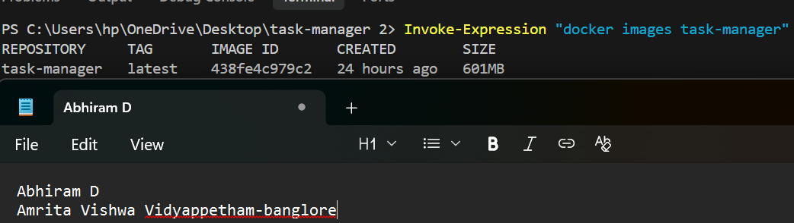
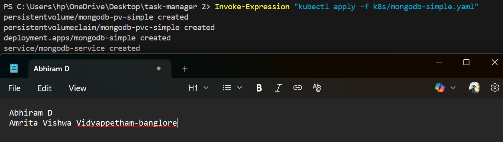
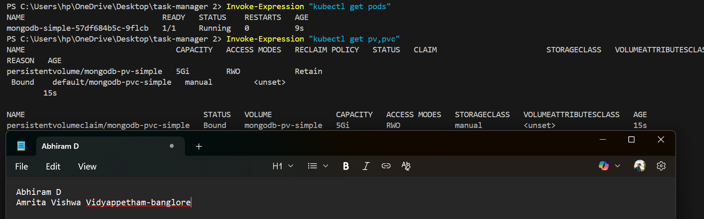
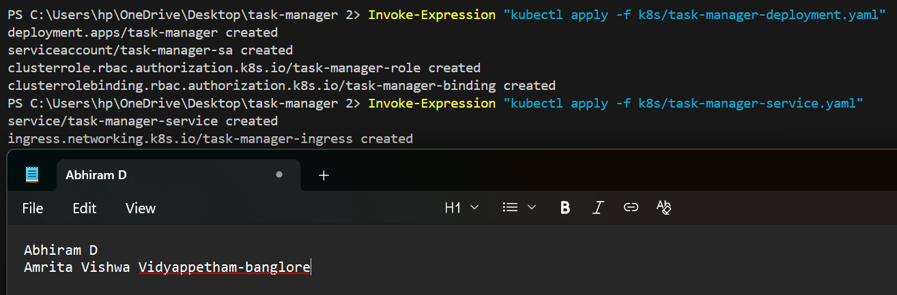
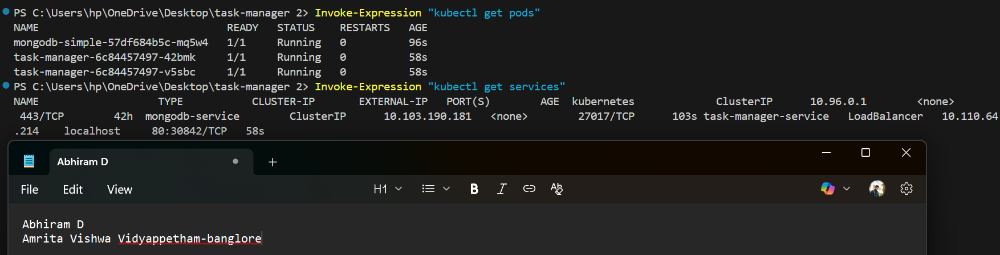
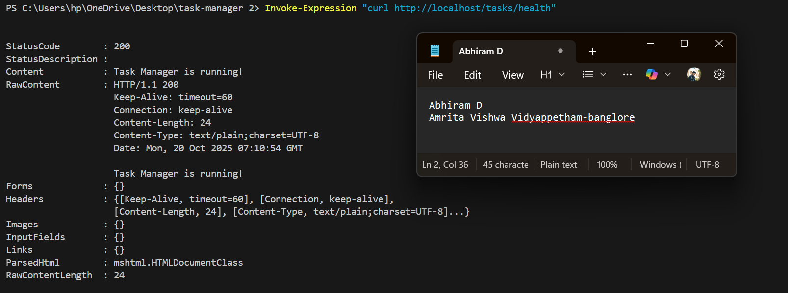
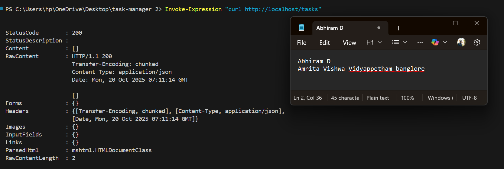

# Task Manager - Kubernetes-Native REST API

A Spring Boot application that provides a REST API for managing and executing shell commands in Kubernetes pods. This project demonstrates cloud-native development with MongoDB persistence and dynamic Kubernetes pod execution.

## 🚀 Features

- **REST API** for CRUD operations on task objects
- **MongoDB integration** for persistent data storage
- **Kubernetes pod execution** - Commands run in temporary busybox pods
- **Command validation** to prevent malicious code execution
- **Docker containerization** with multi-stage builds
- **Kubernetes deployment** with RBAC, persistent volumes, and load balancing
- **Automatic cleanup** of temporary execution pods

## 📋 Task Object Structure

```json
{
  "id": "123",
  "name": "Print Hello",
  "owner": "John Smith",
  "command": "echo Hello World!",
  "taskExecutions": [
    {
      "startTime": "2023-04-21T15:51:42.276Z",
      "endTime": "2023-04-21T15:51:43.276Z",
      "output": "Hello World!"
    }
  ]
}
```

## 🔗 API Endpoints

| Method | Endpoint | Description |
|--------|----------|-------------|
| `GET` | `/tasks` | Get all tasks or single task by ID parameter |
| `PUT` | `/tasks` | Create or update a task |
| `DELETE` | `/tasks/{id}` | Delete a task by ID |
| `GET` | `/tasks/findByName?name={name}` | Find tasks by name (partial match) |
| `PUT` | `/tasks/{id}/execute` | Execute task command in Kubernetes pod |
| `GET` | `/tasks/health` | Health check endpoint |

## 🛠️ Technology Stack

- **Java 17** with Spring Boot 3.5.6
- **MongoDB** for data persistence
- **Docker** for containerization
- **Kubernetes** for orchestration and pod execution
- **Maven** for dependency management
- **Lombok** for reducing boilerplate code

## 📦 Prerequisites

- Java 17+
- Maven 3.6+
- Docker Desktop with Kubernetes enabled
- kubectl CLI tool

## 🚀 Quick Start

### Local Development

1. **Start MongoDB**
   ```bash
   docker run -d -p 27017:27017 --name mongodb mongo:latest
   ```

2. **Run the application**
   ```bash
   mvn spring-boot:run
   ```

3. **Test the API**
   ```bash
   curl http://localhost:8081/tasks/health
   ```

### Kubernetes Deployment

1. **Build Docker image**
   ```bash
   mvn clean package
   docker build -t task-manager:latest .
   ```

2. **Deploy to Kubernetes**
   ```bash
   kubectl apply -f k8s/mongodb-simple.yaml
   kubectl apply -f k8s/task-manager-deployment.yaml
   kubectl apply -f k8s/task-manager-service.yaml
   ```

3. **Verify deployment**
   ```bash
   kubectl get pods
   kubectl get services
   ```

4. **Test the application**
   ```bash
   curl http://localhost/tasks/health
   ```

## 📸 Deployment Screenshots

### 1. Docker Image Build

*Screenshot of `docker images task-manager` showing the built image*

### 2. MongoDB Deployment

*Screenshot of `kubectl apply -f k8s/mongodb-simple.yaml` command output*

### 3. MongoDB Verification

*Screenshots showing MongoDB pod running and persistent volume bound*

### 4. Application Deployment

*Screenshots of both deployment commands for the task manager application*

### 5. All Pods Running

*Screenshots showing all pods ready and LoadBalancer service active*

### 6. Health Endpoint Test

*Screenshot of successful health endpoint response*

### 7. Task Execution Demo

*Screenshot showing task creation and execution with Kubernetes pod*

### 8. Complete Deployment

*Screenshot of `kubectl get all` showing full deployment*


## 🧪 Testing the API

### Create a Task
```bash
curl -X PUT http://localhost/tasks \
  -H "Content-Type: application/json" \
  -d '{
    "id": "demo-task",
    "name": "Demo Task",
    "owner": "Demo User",
    "command": "echo Hello from Kubernetes!"
  }'
```

### Execute the Task
```bash
curl -X PUT http://localhost/tasks/demo-task/execute
```

### Get All Tasks
```bash
curl http://localhost/tasks
```

### Find Tasks by Name
```bash
curl "http://localhost/tasks/findByName?name=Demo"
```

## 🏗️ Architecture

### Application Components
- **TaskController** - REST API endpoints
- **TaskRepository** - MongoDB data access
- **KubernetesService** - Pod creation and management
- **Task & TaskExecution** - Domain models

### Kubernetes Resources
- **Deployment** - Application pods with 2 replicas
- **Service** - LoadBalancer for external access
- **Ingress** - HTTP routing
- **ServiceAccount** - RBAC permissions for pod creation
- **PersistentVolume** - MongoDB data storage

### Security Features
- Command validation to prevent malicious code
- Non-root container execution
- RBAC permissions for Kubernetes API access
- Resource limits and health checks

## 🔧 Configuration

### Environment Variables
- `MONGODB_URI` - MongoDB connection string (default: mongodb://mongodb-service:27017/kaiburr_assessment)
- `SERVER_PORT` - Application port (default: 8080)
- `KUBERNETES_NAMESPACE` - K8s namespace (default: default)

### Application Properties
```properties
spring.application.name=task-manager
spring.data.mongodb.uri=${MONGODB_URI:mongodb://localhost:27017/kaiburr_assessment}
server.port=${SERVER_PORT:8081}
kubernetes.namespace=${KUBERNETES_NAMESPACE:default}
```

## 🐳 Docker Configuration

The application uses a multi-stage Docker build:
- **Build stage** - Maven with JDK 17 for compilation
- **Runtime stage** - JRE 17 for optimized production image
- **Security** - Non-root user execution
- **Health checks** - Built-in container health monitoring

## ☸️ Kubernetes Features

### Dynamic Pod Execution
When a task is executed, the application:
1. Creates a temporary busybox pod in Kubernetes
2. Runs the command inside the pod
3. Captures the output and execution times
4. Automatically cleans up the pod
5. Stores the execution results in MongoDB

### Persistent Storage
- MongoDB uses a PersistentVolume for data persistence
- Data survives pod restarts and redeployments
- 5Gi storage allocation with manual storage class

### High Availability
- 2 replica pods for the application
- LoadBalancer service for traffic distribution
- Health checks and automatic restart policies

## 🔍 Monitoring and Debugging

### View Application Logs
```bash
kubectl logs -l app=task-manager
```

### Monitor Pod Creation
```bash
kubectl get pods -w
```

### Check Execution Pods
```bash
kubectl get pods -l app=task-execution
```


## 📝 Development Notes

### Command Validation
The application validates commands to prevent execution of potentially malicious code:
- Blocks commands containing: `;`, `&`, `|`, `` ` ``, `<`, `>`, `$`
- Returns HTTP 400 for invalid commands

### Graceful Degradation
- Falls back to simulation mode if Kubernetes is unavailable
- Continues to function for CRUD operations even without K8s


### Task 2: Kubernetes Deployment ✅
- ✅ Docker containerization with optimized builds
- ✅ Kubernetes manifests (Deployment, Service, Ingress)
- ✅ MongoDB in separate pod with persistent volume
- ✅ Environment variable configuration
- ✅ LoadBalancer service for external access
- ✅ Kubernetes API integration for pod execution
- ✅ Busybox image for command execution
- ✅ Automatic pod cleanup and resource management


